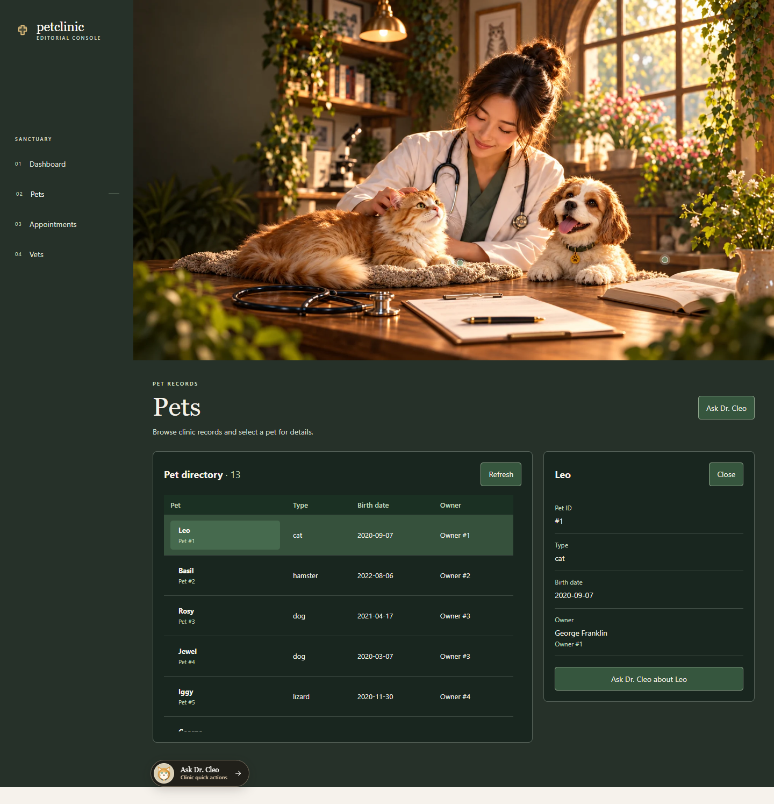
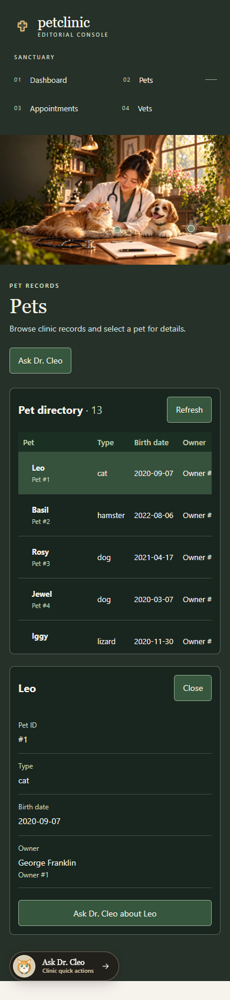
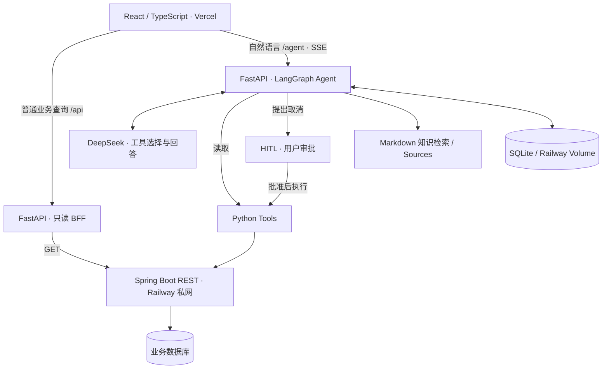

# PetClinic AI Copilot

**Java 业务后端 + Python AI Agent + React 工作台。** 普通宠物查询通过只读 BFF 访问 Spring Boot；自然语言任务通过 LangGraph Tools 访问同一个业务后端。预约取消在真正写入前暂停，等待用户审批。

**v1 — production-ready demo milestone**：已部署并完成真实数据验收的演示里程碑。当前范围是只读 Pets 页面和现有 Copilot 工作流，不包含宠物编辑、删除或传统预约管理页面。

- [正式演示](https://petclinic-ai-copilot.vercel.app/)
- [FastAPI 健康检查](https://petclinic-ai-copilot-production.up.railway.app/health)
- [Java 业务后端仓库](https://github.com/yuabc55/spring-petclinic-rest)
- [架构与边界](ARCHITECTURE.md) · [前端配置说明](frontend/README.md)

## 产品展示



<details>
<summary>390px 手机布局</summary>



</details>

截图来自 2026-10-03 的 Vercel Preview 线上验收，业务代码版本为 `0b3a901`，使用 Railway 上的真实 Java API 响应。数据数量是验收时的结果，页面始终按接口返回展示。

## 架构



FastAPI BFF 与 Agent 是同一个 Python 服务中的两组入口。Java 独立部署并负责业务校验、事务和最终状态；浏览器访问公开 FastAPI，Python 在 Railway 私网调用 Java。Agent 不直接连接业务数据库。

## 当前能力

| 能力 | 实现与边界 |
| --- | --- |
| Pets 列表与详情 | 普通 GET 请求读取宠物 ID、名字、类型、出生日期和主人姓名；支持加载、错误重试、键盘操作和移动端表格滚动 |
| 宠物自然语言查询 | `get_pet` 查询单只宠物，`list_pets` 查询列表与总数；总数来自实际数组长度 |
| 预约查询与取消 | `get_appointment` 读取实时状态；取消提案使用返回的版本，LangGraph 在写入前触发 HITL |
| SSE 与 Copilot Drawer | 展示工具活动、回答和审批卡；Markdown 表格支持独立横向滚动 |
| 知识与 Sources | `search_knowledge` 检索本地 Markdown 章节，返回标题、章节和片段；不会伪造来源 |
| 会话恢复 | 浏览器保留 `thread_id`，FastAPI 从 SQLite checkpoint 恢复可见消息与待审批状态 |

产品 Agent 只拥有已注册的 Tools：`get_pet`、`list_pets`、`get_appointment`、`search_knowledge`、`cancel_appointment`。没有 `update_pet`、`create_pet` 或 `delete_pet`。开发运维时执行的数据调整不属于产品内 Agent 能力。

Appointments 和 Vets 仍是场景说明与 Copilot 入口，不展示虚构的业务列表。当前演示没有产品用户登录层，SQLite 仅支持单实例恢复，Java 默认 H2 数据可能在重启后重置。详细边界见 [ARCHITECTURE.md](ARCHITECTURE.md)。

## Start on Windows (three terminals)

1. Start the separate Spring PetClinic REST project using its own README. From its project root in PowerShell: `./mvnw.cmd spring-boot:run`. Wait for `http://localhost:9966/petclinic/actuator/health` to become healthy. The Agent does not access H2 directly.
2. In this Agent project, create and use a local virtual environment:

   ```powershell
   py -3 -m venv .venv
   .\.venv\Scripts\python.exe -m pip install -r requirements.txt
   $env:DEEPSEEK_API_KEY = [System.Net.NetworkCredential]::new('', (Read-Host 'DeepSeek API key' -AsSecureString)).Password
   $env:DEEPSEEK_BASE_URL = 'https://api.deepseek.com'
   $env:DEEPSEEK_MODEL = 'deepseek-flash'
   $env:PETCLINIC_BASE_URL = 'http://localhost:9966/petclinic/api'
   $env:CHECKPOINT_DB_PATH = '.agent-state/checkpoints.sqlite3'
   .\.venv\Scripts\python.exe -B -X utf8 -m uvicorn demo_petclinic_api:app --host 127.0.0.1 --port 8000
   ```

   `.env.example` documents these variables but is not loaded automatically. Keep the real key out of source control. An optional `PETCLINIC_USERNAME` and `PETCLINIC_PASSWORD` pair is supported when backend Basic authentication is enabled. The SQLite checkpoint path is resolved relative to this project, even if Uvicorn is launched from another working directory. Keep one Uvicorn worker for this local SQLite setup.
3. In the `frontend` directory, run `pnpm install` and `pnpm dev`, then open `http://127.0.0.1:5173`. Vite proxies `/agent` and `/api` to FastAPI at port 8000. See [frontend/README.md](frontend/README.md). Ordinary Pets queries do not require a model key; general Agent conversations do.

## API and checks

- `GET /health`
- `GET /api/pets`, `GET /api/pets/{pet_id}`, `GET /api/owners/{owner_id}`: read-only business queries, independent of the model and Graph. Owner summaries contain only ID and name. Java HTTP errors remain errors rather than becoming empty lists.
- `POST /agent/chat` with `{"message":"查询宠物1的信息","thread_id":null}`
- `POST /agent/chat/stream` with the same body; SSE emits started, tool events, approval_required or completed.
- `GET /agent/{thread_id}/state` reads the latest SQLite checkpoint without executing the graph. It returns `thread_id`, `status`, visible `messages`, pending `approval` (or null), and `sources`; an unknown thread returns 404. Keep thread IDs private: this local demo has no login layer.
- `POST /agent/{thread_id}/resume` with `{"decision":"approve"}` or `{"decision":"reject"}`. Use the same thread ID returned by the interrupt. Completed responses include `message` and `sources`; sources have title, section and snippet.

Run offline regression tests with `./.venv/Scripts/python.exe -B -X utf8 -m unittest discover -s tests -v`. These replace the model and PetClinic HTTP in process; they do not consume API credit or mutate appointments. Restarting only FastAPI preserves pending approvals in the configured SQLite file. Do not delete that file while an approval is pending.

## 部署与 v1 验收

- **Vercel**：Root Directory 为 `frontend`，构建 `pnpm build`，输出 `dist`。设置 `VITE_AGENT_MODE=api`、`VITE_AGENT_API_BASE_URL=https://petclinic-ai-copilot-production.up.railway.app`，并覆盖正式部署环境。
- **Railway Python**：使用 `railway.json`，启动 `uvicorn demo_petclinic_api:app --host 0.0.0.0 --port $PORT`，健康检查 `/health`。
- **Railway Java**：`PETCLINIC_BASE_URL=http://spring-petclinic-rest.railway.internal:9966/petclinic/api`；浏览器不直接访问私网域名。
- **CORS / 恢复**：`FRONTEND_ORIGINS` 明确包含前端正式来源；`CHECKPOINT_DB_PATH=/data/agent-checkpoints.sqlite` 位于挂载 Volume 内。使用一个实例、一个 API worker。
- **分支**：`main` 承载发布版本；后续功能使用单独 feature branch，通过 PR 进入 `main`。

2026-10-03 的线上验收已确认 `/api/pets`、`/api/pets/1`、`/api/owners/1` 均为 200；读取到 13 只宠物，桌面 1440×900 和手机 390×844 通过。Leo 的详情显示出生日期 `2020-09-07` 与主人 George Franklin。此记录属于该日期和数据快照。

v1 业务代码的已确认回归结果为 Python **30/30**、前端 **30/30**，生产构建成功。前端在 `frontend` 目录运行 `pnpm test`、`pnpm build`。正式域名 smoke test 以对应 Release / PR 的验收记录为准。

## 展示脚本（约 90 秒）

1. **0–20 秒**：展示画报工作台和 Pets 页面，说明 Java 是真实业务数据来源。
2. **20–45 秒**：选择 Leo，展示类型、出生日期、主人姓名；在 Network 展示三个 `/api` 请求，说明普通查询不调用模型。
3. **45–65 秒**：打开 Dr. Cleo，输入 `how many pets in total`，展示工具执行和实际总数；再用 `Show pet 1` 展示单条查询。
4. **65–90 秒**：切换到 390px 手机视图，展示场景、滚动表格和详情。预约审批流程可使用离线回归说明，本脚本不执行真实预约变更。

这是录屏脚本，不代表已生成 Demo 视频。

## 简历项目描述

> PetClinic AI Copilot：基于 Spring Boot 业务后端构建 React + FastAPI 应用，将普通业务查询与 LangGraph AI Copilot 分离。实现只读宠物列表及详情 BFF、基于真实 REST 数据的 Agent Tools、SSE 工具活动展示、HITL 预约取消审批、SQLite 会话恢复和来源展示；完成 Vercel / Railway 独立服务部署及桌面、移动端线上验收。
