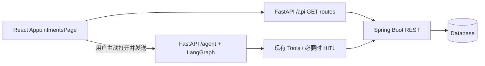

# PetClinic AI Copilot v1.1：Appointments 只读业务页实施 Handoff

状态：规划已完成，功能尚未实施。日期：2026-10-03。

## 1. 目标、基线与执行边界

将 Appointments 从画报入口升级为真实预约列表与详情页面。Java 保持业务数据及规则的权威来源；FastAPI 提供只读 BFF；React 负责展示。普通查询不经过 LLM。

用户已确认并冻结以下事实，不需要重新验收 v1 才开始开发：

- `main` 已发布；`v1.0.0-demo` 对应 `bca00dd40106faa65d21fb3fe562783d49d2bb35`。
- Production 已验收；Pets 真实列表和详情、React → BFF → Java 链路已通过。
- Agent SSE / HITL / Sources / thread recovery 保持正常。
- 正式前端：`https://petclinic-ai-copilot.vercel.app/`。
- Python 后端：`https://petclinic-ai-copilot-production.up.railway.app`。

本次规划只新增本文件，不修改代码、不创建分支、不提交、不推送、不部署。后续执行 Agent 获得实施授权后，从干净的冻结基线创建 `feat/appointments-readonly`，所有实现提交只进入该分支。若存在其他 Agent 未提交工作，先报告并隔离，禁止覆盖或清理。

**本计划明确选定的最小产品范围：按兽医选择预约列表 + 单条预约详情。没有全院预约总数，也没有“所有兽医”聚合选项。** 当前 Java 没有全量预约 GET 接口。若产品必须提供全院列表，应另行批准 API 扩展或 BFF 聚合方案，不能假装现有接口已支持。

## 2. 权威输入与审查依据

Agent 仓库：`C:\Users\26625\temp-learning-tool-demo`，远端 `yuabc55/petclinic-ai-copilot`。

本轮实际阅读的实现：

- `frontend/src/PetsPage.tsx`、`frontend/src/petApi.ts`。
- `frontend/src/App.tsx`、`frontend/src/styles.css`、`frontend/vite.config.ts`。
- `demo_petclinic_business_api.py`、`demo_petclinic_api.py`。
- `demo_petclinic_cancel_agent.py` 中的 `request_json`；`demo_petclinic_tools.py` 中的 URL / timeout。
- `tests/test_pet_business_api.py`、`frontend/tests/PetsPage.test.tsx`。

Java 仓库：`D:\Codex\Projects\JavaProjects\spring-petclinic-rest`，远端 `yuabc55/spring-petclinic-rest`；本轮只读审查版本 `ea5e9cd8744229d24a813a8018de0a80a7630990`，分支 `feature/appointment-booking`，工作区干净。

Java 路径以该仓库为根：

| 文件 / 符号 | 已确认的依据 |
|---|---|
| `src/main/resources/openapi.yml`，`/appointments`、`/appointments/{appointmentId}`、`/vets/{vetId}/appointments` | 创建、详情、按兽医列表契约；`/appointments` 只有 POST，没有 GET |
| `src/main/java/org/springframework/samples/petclinic/rest/controller/AppointmentRestController.java` | `getAppointment` 的权限及详情映射 |
| 同目录 `VetRestController.java` | `listVets`、`listVetAppointments`、`getVet` 的权限和空值语义 |
| `src/main/java/org/springframework/samples/petclinic/service/AppointmentService.java` | `findByVetId` 检查兽医存在；`findById` 找不到预约时抛异常 |
| `src/main/java/org/springframework/samples/petclinic/repository/AppointmentRepository.java` | `findByVetIdOrderByStartAt`，无状态或日期过滤，无分页 |
| `src/main/java/org/springframework/samples/petclinic/mapper/AppointmentMapper.java` | pet/vet 关系映射为 ID；Instant 映射为 UTC OffsetDateTime |
| `src/main/java/org/springframework/samples/petclinic/model/AppointmentStatus.java` | 四个真实枚举值 |
| `src/main/java/org/springframework/samples/petclinic/security/{Roles,BasicAuthenticationConfig,DisableSecurityConfig}.java` | 权限字符串、Basic Auth、启停条件 |
| `src/main/resources/application.properties` | 源码默认 `petclinic.security.enable=false` |
| `src/test/java/org/springframework/samples/petclinic/rest/controller/AppointmentApiIntegrationTests.java` | 已有详情和按兽医列表集成测试源码 |

也阅读了 `target/generated-sources/openapi/.../AppointmentDto.java`，确认字段类型。该目录为生成产物，不能作为手工修改入口；OpenAPI 才是 DTO 契约来源。

以上是本地代码审查，不代表已核实线上 Java 的部署 SHA、权限变量或当前预约数据。本轮没有运行服务、调用生产 API 或执行测试。后续部署验收须核对线上契约，不能把源码默认安全开关当成生产配置。

## 3. 可复用结构与最小改法

| 现有结构 | v1.1 使用方式 |
|---|---|
| `PetsPage` 的 list/detail 独立状态、Refresh/Retry、AbortController | 在新的 `AppointmentsPage` 使用相同模式；切换兽医或预约时取消旧请求并忽略迟到响应 |
| 详情 focus、Escape 关闭、焦点回到原按钮 | 延续无障碍行为；不新建 modal，不与 Agent Drawer 焦点管理竞争 |
| `petApi` 的 fetch base、AbortSignal、运行时解析和 ID 匹配 | 新建 `appointmentApi.ts` 使用相同约定；直接复用已有 `getPet` 补充详情宠物姓名，不重构公共客户端 |
| BFF `router`、`read_record`、Pydantic 响应过滤 | 在原 BFF 文件追加预约与兽医摘要 GET 路由；保持现有 pet/owner 路由行为 |
| `request_json` | 列表用 `allow_list=True`，详情使用默认 object；复用凭据、5 秒 timeout 和错误处理，不修改 helper |
| `App` 的 page state、`openDrawer`、`triggerPrompt` | 为 Appointments 增加独立渲染分支；详情入口调用 `triggerPrompt('Show appointment ' + id)`，仅预填，用户提交后才发起 Agent 请求 |
| Pets 的场景图片在上、业务内容在下、深绿内容区 | 为 Appointments 添加对应 class 和限定样式，桌面列表/详情并列，窄屏纵向排列；保持完整画报，不重新设计全站 |
| Vite `/api` 代理及 `VITE_AGENT_API_BASE_URL` | 原样复用，不增加浏览器 Java 地址或新代理服务 |
| 现有 unittest / Vitest 测试组织 | 新增预约测试文件，保留原有回归 |

实现阶段不抽取通用 CRUD 框架，不引入路由库、状态库或 UI 依赖，不为复用大改 PetsPage。CSS 可用组合选择器共享现有声明，并增加少量预约专用选择器；修改既有选择器时必须回归 Pets。

## 4. Java REST、DTO 与权限结论

下面的 Java 路径相对于 `PETCLINIC_BASE_URL`，生产基址为 `http://spring-petclinic-rest.railway.internal:9966/petclinic/api`。不能再拼接第二个 `/api`。

| Java GET | 成功值 | 权限开启时 | 特殊语义 |
|---|---|---|---|
| `/vets` | Vet 数组 | `ROLE_VET_ADMIN`，控制器使用 `hasRole(@roles.VET_ADMIN)` | 当前实现没有兽医时返回 404，不能改写成成功空数组 |
| `/vets/{vetId}/appointments` | Appointment 数组，按 startAt 升序 | `ROLE_OWNER_ADMIN` 或 `ROLE_VET_ADMIN` | 兽医存在但无预约为 200 `[]`；兽医不存在为 404 |
| `/appointments/{appointmentId}` | Appointment object | `ROLE_OWNER_ADMIN` 或 `ROLE_VET_ADMIN` | 预约不存在为 404 |
| `/pets/{petId}` | Pet object | 沿用现有 Pets 路由的 Java 权限 | 仅用于选中预约后补充宠物姓名；失败不隐藏预约 |

`Roles` 中的值本身含 `ROLE_` 前缀。BFF 凭据机制已存在于 `request_json`：`PETCLINIC_USERNAME` / `PETCLINIC_PASSWORD`，仅存于服务端。若生产开启安全模式，本页兽医目录需要具有 `ROLE_VET_ADMIN` 的现有服务凭据；只有 OWNER 权限可能读得到预约，却读不到兽医目录。必须报告 401/403，不能关闭 Java 安全、修改角色或暴露凭据来绕过。普通页面权限以实际服务配置为准，本项目尚无新增的浏览器用户身份系统。

Appointment DTO 必须保留以下字段：

| 字段 | Java 类型 / 含义 | BFF 与前端约束 / 展示 |
|---|---|---|
| `id` | Integer，预约 ID | 严格正整数，int32 范围；列表和详情显示 |
| `petId` | Integer | 同上；列表显示 Pet #ID，详情可附真实姓名 |
| `vetId` | Integer | 同上；从已加载目录匹配姓名并保留 ID |
| `startAt` | OffsetDateTime，预约开始时间 | 必须为带 offset 的有效 ISO 日期时间；固定显示 UTC，并明确标注 UTC |
| `status` | AppointmentStatusDto | `REQUESTED`、`CONFIRMED`、`CANCELLED`、`COMPLETED`；文字徽标，不只靠颜色 |
| `createdAt` | OffsetDateTime | 同 startAt 校验；仅详情显示 |
| `version` | Long，乐观锁版本 | 严格非负整数；BFF 保留，前端要求安全整数；本页不做更新、不发送 expectedVersion、不必在 UI 展示 |

不存在 petName、vetName、endAt、duration、notes、location 等预约字段，不得推导或伪造。`COMPLETED` 是已定义状态，但不能据此宣称系统已有完成预约功能。读取历史记录必须允许过去的 startAt，不能复制创建请求的 `@Future` 限制；不能按当前时间自动推断完成或过期状态。

## 5. 选定的数据流和 BFF 契约



新增 3 个固定 GET 路由，不新增通用透传代理：

| 浏览器 / BFF | Java 请求 | BFF response_model |
|---|---|---|
| `GET /api/vets` | `GET /vets`，`allow_list=True` | `list[VetSummary]`，每项仅 `{id, firstName, lastName}` |
| `GET /api/vets/{vet_id}/appointments` | `GET /vets/{vet_id}/appointments`，`allow_list=True` | `list[AppointmentRecord]` |
| `GET /api/appointments/{appointment_id}` | `GET /appointments/{appointment_id}`，默认 object | `AppointmentRecord` |

前端 `appointmentApi.ts` 导出 `listVets(signal)`、`listVetAppointments(vetId, signal)`、`getAppointment(id, signal)` 及类型；返回裸数组/对象，与既有 BFF 保持一致，不增加虚构的 total/page 元数据。

请求顺序：

1. 进入页面只请求 `/api/vets`，显示带 label 的原生 select，初始提示“Select a veterinarian”。不默选并不把第一名兽医的数据当全院数据。
2. 用户选择兽医，清空旧详情与旧列表，GET 对应预约数组。标题标明该兽医和“返回 N 条预约”；不称全院总数。不循环请求所有兽医，不枚举 appointment ID。
3. 点击真实列表条目，GET 该预约详情，校验返回 id；再通过现有 `getPet(petId, signal)` 请求 `/api/pets/{petId}`。列表阶段不逐行请求宠物，避免 N+1。
4. 兽医姓名来自已加载真实目录；详情中的 vetId 不在目录中时仅显示 ID，并标明姓名不可用。不请求不存在的姓名字段，不需要新建 `/api/vets/{id}` 路由。
5. 详情请求使用新鲜记录；若其 vetId 已不属于当前选择，清除详情并提示刷新列表，不显示错误归属。刷新/切换兽医关闭详情；旧请求不能恢复旧内容。
6. 查询结果只保存在组件状态，不保存到 Agent thread、不创建 checkpoint、不轮询、不后台批量查询。页面刷新按当前选择重查；目录错误和列表错误提供各自 Retry。

BFF 追加模型及校验规则：

- 路径 ID 使用既有 `Path(gt=0, le=2147483647)`；非法 ID 返回 422，不能调用 Java。
- `AppointmentRecord` 对三个 ID、version 使用严格整型，拒绝 bool、数字字符串；状态使用限定枚举。
- 两个时间字段必须验证原始值为 string，具有时区并可解析；可用 Pydantic `AwareDatetime` 配合 before validator 拒绝数字时间戳。不要只用宽松 `datetime` 自动接受无时区值。
- 新列表路由拒绝重复 ID；预约列表各条 vetId 必须等于路径 vetId；详情 ID 必须等于路径 ID。不静默丢弃坏数据。
- VetSummary 的姓名字段要求有效非空字符串，过滤 Java specialties 等本页不需要的字段。
- 正常空预约数组返回 200 `[]`。任何 401/403/404/5xx 保留原状态；连接失败、非 JSON、形状错误、无效字段/重复 ID/不匹配 ID 均为 502。复用 `read_record` 的通用错误文本，不向浏览器泄漏凭据、内网诊断信息。
- 未知状态按契约错误处理，不能映射为 REQUESTED。未来状态扩展应同时更新契约与测试。
- 不因一个新增接口而改变原 pets/owners 的校验、错误协议。新增路由自己的检查放在新函数中。

## 6. 页面最小功能与交互

- 标题 Appointments、简短只读说明、真实兽医选择器、Refresh、现有 Ask Dr. Cleo 入口。
- 列表列：Appointment #ID、Start time (UTC)、Status、Pet #ID、Veterinarian（真实姓名 + #ID）。保留 Java 的时间排序；不增加服务端分页/日期过滤/搜索。
- 详情：预约 ID、状态、开始时间、创建时间、宠物姓名（可用时）+ ID、兽医姓名（可用时）+ ID。宠物补充查询失败只显示局部错误和 Retry，不隐藏已读到的预约。
- UTC 是 v1.1 明确的显示策略，使用 `Intl.DateTimeFormat` 的 `timeZone: 'UTC'`，并用 `<time dateTime={原始值}>`；不要依赖运行机器时区。拒绝无效日期，不能显示 Invalid Date。
- 初始选择提示、目录加载/失败、预约列表加载/空/失败、详情加载/失败、宠物名部分失败均有明确状态。只有成功数组才显示数量。
- 桌面沿用 Pets 的完整场景图 + 下方业务内容布局；列表/详情在空间足够时并列。不要加遮挡海报的大奶白卡片或新的复杂侧滑面板。
- 390px 使用完整场景图、画面下方操作和纵向详情；表格可在有 label、可键盘聚焦的区域内横向滚动，整页不得溢出。Dr. Cleo 放在内容流中，不能覆盖记录或按钮。
- select 有 label；按钮至少 44px；列表用 table/caption/th scope；状态有文字；加载用 role=status/aria-busy，错误用 role=alert；键盘可选预约，详情聚焦、Escape/Close 关闭后焦点恢复到来源按钮。
- Agent Drawer 保持现有 modal/inert/focus 行为。打开入口只预填 `Show appointment {真实ID}`；不自动发送，不生成取消指令。
- 用户通过现有 Agent 做出变化后，可以手动 Refresh 重新读取；本轮不新增 Agent 与列表自动同步订阅。

## 7. Agent 与业务页边界

普通目录、列表、详情和宠物补充查询全部是 `/api` GET，禁止调用模型、Agent Tools、`/agent/chat/stream` 或 checkpoint API 来加载页面。BFF 直接调用 HTTP helper，不经 Tool.invoke 或 Graph。

用户主动使用 Copilot 时继续原有 `/agent`、Tools、SSE 和 HITL。保留现有查询与取消能力，但本轮不新增 list_appointments Tool，不改变提示词/guard/取消规则，不把 BFF 变成 Agent 写操作的替代入口。

“页面只读”指新增业务路由与按钮；已有 Agent 写操作仍受既有 HITL 约束，不属于本轮新增能力。生产验收本轮只做读取，不为了验证 HITL 真正取消预约。

## 8. 后续实现文件清单

| 文件 | 动作 | 最小内容 |
|---|---|---|
| `demo_petclinic_business_api.py` | 修改 | 两个新模型、三个 GET 路由、预约范围/ID/重复值校验 |
| `tests/test_appointment_business_api.py` | 新增 | 独立 BFF contract tests |
| `frontend/src/appointmentApi.ts` | 新增 | DTO 类型、三个 GET adapter、运行时校验 |
| `frontend/src/AppointmentsPage.tsx` | 新增 | 兽医选择、列表、详情和 Copilot 回调 |
| `frontend/src/App.tsx` | 修改 | import、Appointments 渲染分支、场景 class 与回调接线 |
| `frontend/src/styles.css` | 修改 | 有范围限定的预约布局与响应式样式 |
| `frontend/tests/AppointmentsPage.test.tsx` | 新增 | 页面、adapter 和 App 集成行为测试 |

`PetsPage.tsx`、`petApi.ts`、`demo_petclinic_api.py`、Vite 配置、依赖及 lockfile 预期无需修改：router 已注册，宠物读取和 `/api` 代理已存在。不要为了完成清单机械修改这些文件。若现有测试明确断言 Appointments 占位页，可最小更新对应 `frontend/tests/AgentDrawer.test.tsx` 断言并在最终 diff 说明；不删除有效回归断言。

本 handoff 为本轮唯一新增文件，未来实现分支可携带。README/架构图/Release 包装等待实施及验收后另行处理。

## 9. 实施步骤与测试矩阵

获得实施授权后依次完成：创建 feature 分支 → BFF 契约/测试 → adapter/页面/测试 → App 与限定 CSS 接入 → 完整回归/build → 本地浏览器 QA → diff 审查。全部通过才提出提交/Preview 部署；此 handoff 本身不授权自动合并 main 或修改 Production 部署配置。

### Python BFF contract tests

参照 `tests/test_pet_business_api.py`：在小型 FastAPI app 中仅注册 business.router，用 TestClient 和 `patch.object(business, 'request_json')`；不依赖模型凭据、Java 服务或 checkpoint。

至少覆盖：

1. 三个 GET 精确调用对应 Java path/method，只有列表带 `allow_list=True`；VetSummary 输出仅允许字段。
2. 预约完整字段及四个状态可读取，包括过去时间；时间带 Z / 非零 offset 均正确，version=0 正常。
3. 200 `[]` 与各类错误区分；兽医目录 404 保持 404；预约列表 401/403/404/500/503 不成为空列表。
4. 连接失败、错误 JSON、null/object 冒充列表、坏元素、缺字段、bool/string ID、负 version、未知状态、无时区/数字/非法日期为 502。
5. 重复预约/兽医 ID、预约列表 vetId 不一致、详情 id 不一致为 502。
6. 非法/越界路径 ID 返回 422 且不触达 Java。
7. 对新列表/详情路径的 POST/PUT/PATCH/DELETE 返回 405；`/api/appointments/{id}/cancel`、`/confirm` 没有 BFF 写路由（404/405），均不触达 Java。
8. 原 Pets/Owner contract tests、Agent/tool/CORS/state 测试继续通过；不修改旧断言以掩盖回归。

### React component / adapter tests

使用现有 Vitest + jsdom + React act/createRoot + fetch mock，不新增测试库。可以在页面测试文件直接测试导出的 adapter。

至少覆盖：目录与选择提示；选择正确 vet 后调用正确路径；真实字段及 UTC 显示；四种状态；空列表与 HTTP/解析错误；重试/刷新；详情 ID/列表 vetId/重复 ID 校验；宠物名失败时详情保留；详情 ID 不匹配；切换预约、切换兽医、切换页面时 abort 与迟到响应保护；Refresh 清理旧详情；键盘 focus/Escape 恢复；无任何写按钮。

App 集成断言：Appointments 导航实际挂载新页面，Pets/Vets 导航不受影响；点击详情 Copilot 后仅预填 `Show appointment {id}`，未发起 `/agent` 请求；普通浏览所有请求都是预期 `/api` GET。回归现有 AgentDrawer 测试，不直接在生产触发 HITL。

### 命令与执行位置

在 Agent 仓库根目录运行：

```powershell
.\.venv\Scripts\python.exe -B -X utf8 -m unittest discover -s tests -v
pnpm --dir frontend test
pnpm --dir frontend build
git diff --check
git status --short --branch
git diff --stat
```

依赖已经存在则不重装。若 Codex 环境出现 esbuild `spawn EPERM`，记录为环境阻断，请用户在普通 PowerShell 的仓库根目录执行上述两个 pnpm 命令；不能修改业务代码绕过，也不能报告成断言失败或通过。报告实际测试总数，不预设新的总数。

### 浏览器 QA

- 1440×900 和 390×844：进入 Appointments、选择真实兽医、列表、打开/关闭详情、刷新、键盘操作、打开/关闭 Copilot；检查横向滚动仅在表格容器，document.scrollWidth 不超过 viewport。
- 验证画报完整、导航可读、内容和 Cleo 不相互遮挡；Drawer 的遮罩、inert、焦点和手机布局保持正常。
- Network 证明目录/列表/详情/宠物补充只走 BFF GET；在主动发送 AI 消息前没有 LLM 请求。
- 用浏览器 route mock/测试环境覆盖空、错误、较长文本和快速切换；合成 fixture 必须标为测试数据，不能作为生产截图或在线成功证据。
- 对 Pets 做一次简短列表/详情冒烟以覆盖共享 App/CSS；不重复整套 v1 冻结验收。

## 10. 部署验收条件与阻断处理

开发/本地 QA 完成后，在单独授权的 Preview 环境部署 v1.1：Vercel Preview 与 Railway 的独立预览 BFF 使用同一 feature commit。正式 Railway 仍跟随 main；不能把 Production 服务临时改成 feature 分支。预览 BFF 使用能够访问 Java 的同一 Railway 环境，或明确可达的测试 Java 服务；私网主机名不能假定跨环境可用。

沿用变量名：`VITE_AGENT_MODE=api`、`VITE_AGENT_API_BASE_URL=<预览BFF公网地址>`、`PETCLINIC_BASE_URL=<Java私网基址>`，以及必要的服务端 Basic 凭据。Preview 来源通过该 BFF 的 `FRONTEND_ORIGINS` 配置明确允许；保持 credentials 和显式 origin 策略，不能放开为 `*`。环境配置属于部署工作，实施 Agent 没有部署授权时先报告，不能动 Production 来绕过。

验收必须记录前后端 commit SHA、部署状态、实际请求 URL/status、桌面/手机截图和发现的问题：

1. `/api/vets` → 200，真实兽医摘要；用实际返回 ID 操作，不硬编码 vet=1。
2. `/api/vets/{实际ID}/appointments` → 200；列表范围、数量、status、startAt 与 Java 响应一致，不能把部分数据称全院数据。
3. 从真实非空列表选择预约，`/api/appointments/{实际ID}` → 200，ID/vetId/petId 和详情一致；`/api/pets/{实际petId}` → 200，显示真实名字。没有真实预约时仅可验收空态，详情线上验收标为待完成，禁止自行创建预约；可请求用户提供已有 ID。
4. 浏览器无 CORS/JSON/运行错误；401/403 必须定位服务凭据/权限，404 必须区分部署缺少接口与资源不存在；不能把任一错误替换成 fixture。
5. 桌面及 390px QA 全部通过；普通查询不触发 `/agent`；可通过已有 Agent 做一次只读预约查询，确认 SSE、Drawer 与 Sources 的已有展示仍工作。
6. HITL / thread recovery 依靠既有自动化回归确认本轮未破坏，不宣称本轮重新验证过生产写操作或重启恢复。若额外要求真实写入或重启验收，需要独立授权与专用 fixture。
7. 全量 Python / React 测试、build、diff check 通过；diff 限于第 8 节；无 Java、Graph、SSE、HITL、Sources、恢复逻辑或数据修改。

在本轮“不碰 main”约束下，交付终点是 feature 分支的可审查实现与获准的 Preview 验收。合并 main、正式 v1.1 发布和 Production 冒烟必须获得后续发布授权；不移动或删除 `v1.0.0-demo` 标签、不改写历史。发布授权后才允许把同一审查 SHA 部署到正式前后端并重复上述短冒烟。

当前规划无阻断项。后续可能阻断线上验收的条件：Java 生产契约与审查版本不一致、服务凭据无 VET_ADMIN、没有独立可达的 Preview BFF、没有可用于只读详情验收的真实预约。逐项报告实际证据，不预先断言这些问题已存在。

## 11. 禁止事项与完成报告

禁止修改 Java 业务规则、DTO/Controller/权限；禁止新增写路由、编辑/创建/取消/确认/改签按钮；禁止虚构预约、姓名、状态、时间或数量；禁止枚举 ID 猜列表；禁止新增 Agent Tools 或改变现有 Agent 行为；禁止浏览器直接访问 railway.internal 或泄漏服务凭据；禁止触碰 main、覆盖别人的工作、force push 或破坏 v1 标签。

执行 Agent 最终报告仅包含：完成内容、实际修改文件、测试/build/浏览器结果、未完成的部署验收或阻断项。只有另获提交/部署授权并实际执行时才报告 commit/push/部署结果；不要把本规划写成已上线能力。
